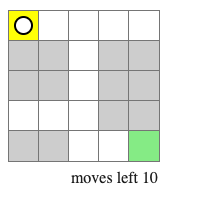

## The rules of the game are the following:
> * You (the black and white circle) start at a customizable initial position
>   
> * You can move using your keyboard's arrows (up/down/left/right)
> * Your objective is to move from the initial cell (yellow) to the target cell (green) before you run out of moves:
>   
> * When you win, you will get a "You won" message and won't be able to move any more
> * If you do run out of moves before you reach the target cell, then you lose:
>   
> * When you lose, you will get a "You lost" message and won't be able to move any more

## Available Scripts

In the project directory, you can run:

### `yarn start`

Runs the app in the development mode.\
Open [http://localhost:3000](http://localhost:3000) to view it in the browser.

The page will reload if you make edits.\
You will also see any lint errors in the console.

### `yarn test`

Launches the test runner in the interactive watch mode.\
See the section about [running tests](https://facebook.github.io/create-react-app/docs/running-tests) for more information.

### `yarn build`

Builds the app for production to the `build` folder.\
It correctly bundles React in production mode and optimizes the build for the best performance.

The build is minified and the filenames include the hashes.\
Your app is ready to be deployed!

See the section about [deployment](https://facebook.github.io/create-react-app/docs/deployment) for more information.
